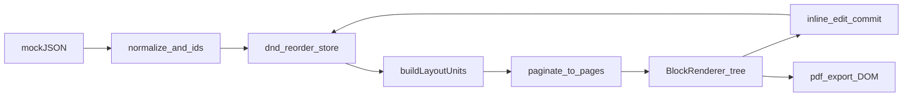

# Dynamic RFP Section Renderer — Architecture & Folder Structure (Revised)

## Product principles (your additions)

- **UI**: shadcn/ui for consistent, accessible primitives, but **visually minimal**—neutral palette (e.g. zinc/slate), generous whitespace, document-first. Avoid decorative chrome beyond clear page separation and toolbar essentials (export, edit hint).
- **Features**: **PDF export and drag-and-drop reorder are both required**, not stretch goals.
- **Quality bar**: After each significant feature, run **ESLint** (and fix warnings where reasonable). Prefer **no `any`**; if used temporarily during a spike, **remove before merging** the feature. **No deprecated npm packages**—prefer maintained libs (`@dnd-kit/*`, `jspdf`, `html2canvas` or actively maintained alternatives); verify on [npm](https://www.npmjs.com/) / release notes before locking versions.
- **Documentation**: Maintain **comprehensive, skimmable docs** so reviewers and teammates can follow intent: architecture, data flow, layout trade-offs, CI, deployment, and responsiveness (see [docs/](#documentation-layout) below).

## Source repository (submission target)

- **GitHub**: [Mhd-Hashaam/RFP-Renderer](https://github.com/Mhd-Hashaam/RFP-Renderer) (clone: `https://github.com/Mhd-Hashaam/RFP-Renderer.git`).
- After the local workspace is implemented, set **`origin`** to that URL and push `main` (or your default branch). Vercel should import the same repo.

## Stack versions (latest Next + React)

- Initialize with **`create-next-app@latest`** (or equivalent) at implementation time so **Next.js** and **React** match current stable releases the tool installs (today that is typically **Next 15.x** with **React 19.x** bundled; exact numbers are pinned in `package.json` after scaffold).
- **Policy**: Before each milestone merge, run `npm outdated` (or `pnpm outdated`) and document intentional pins in README if anything is held back for compatibility.
- Use **only non-deprecated** Next APIs (App Router, `next/image` current props, etc.); follow migration notes from the installed Next version.

## shadcn/ui (premium but minimal)

- Run `npx shadcn@latest init` with defaults aligned to a **clean document** aesthetic.
- **Add only components you use** (e.g. `Button`, `Card`, `Separator`, `Tooltip`, optional `Sheet` for mobile tools)—keeps bundle and mental surface small.
- Customize theme tokens in `globals.css` / CSS variables once for typography and neutrals; blocks stay mostly semantic HTML + Tailwind.

## CI/CD for component testing

- **Runner**: GitHub Actions (`.github/workflows/ci.yml`) on `push` and `pull_request` to default branch.
- **Jobs** (fail fast, parallel where cheap):
  1. **Lint**: `next lint` or ESLint flat config as shipped by CNA.
  2. **Typecheck**: `tsc --noEmit`.
  3. **Unit + component tests**: **Vitest** + **@testing-library/react** + **jsdom**. **Layout logic (`buildLayoutUnits`, `paginate`, `estimateHeight`) is tested as pure functions with no React dependency**—fast, deterministic validation of grouping and pagination. Components get RTL tests with a mocked store where valuable.
- **Optional follow-up**: Playwright for smoke (load page, export PDF button visible)—only if time; not required for “component testing” core.
- **Documentation**: [docs/CI.md](docs/CI.md) — what runs when, how to run locally, how to debug flaky tests.

## PDF export + drag-and-drop (both required)

- **Reorder**: **`@dnd-kit/core`** + **`@dnd-kit/sortable`** on the **canonical ordered `Block[]`** in Zustand (the only persisted document order). **On drop, update that list, then recompute layout units** via `buildLayoutUnits` and re-paginate so heading+body grouping and columns stay structurally correct—this is **data vs derived state**: units/pages are always derived, never manually patched after DnD.
- **PDF**: Client-side **`jspdf`** + **`html2canvas`** (or **`@react-pdf/renderer`** if you prefer vector text—choose one approach and document trade-offs). **Copy for docs**: *“PDF export operates on the rendered DOM rather than the data model to ensure visual parity with the user-facing document.”* Target a **stable DOM subtree** (ref on the pages container); tune `scale` and page size. Note limitations (fonts, multi-page rasterization) in docs.
- **Order of work**: Implement DnD on flat list first, then PDF on rendered output so export reflects current order and matches what the user sees.

## Responsiveness and browsers

- **Breakpoint strategy** (example—tune in implementation):
  - **Small**: single column inside the “page” sheet; optional full-width reading mode; touch-friendly hit targets (min 44px) for edit/DnD handles.
  - **Medium**: 2 columns or still 1 if column width too narrow for RFP readability.
  - **Large**: 3 columns as per challenge.
- Use **`min()` / `max()`**, **container queries** where helpful for column width inside the page card; avoid horizontal page overflow (`overflow-x: auto` only as escape hatch).
- **Cross-browser**: Author CSS that works in **Chromium, Firefox, Safari** (last two major versions); avoid bleeding-edge features without fallbacks. Document a **browser support matrix** in [docs/BROWSERS.md](docs/BROWSERS.md).
- **DnD/PDF on mobile**: DnD can be awkward on small screens—provide **explicit “move up/down”** or a list reorder fallback in addition to DnD where feasible.

## Vercel deployment infrastructure

- **Default path**: Connect repo to Vercel; framework preset **Next.js**; build `next build`, output `.next`.
- **Repo hygiene**: `engines.node` in `package.json` and/or **`.nvmrc`** matching Vercel’s supported LTS to avoid “works on my machine.”
- **Docs**: [docs/DEPLOYMENT.md](docs/DEPLOYMENT.md) — env vars (if any), preview deployments per PR, production branch, optional **Production** vs **Preview** behavior, and any **Edge** considerations (most of this app is static/client-heavy).
- **`vercel.json`**: Add only if needed (redirects, headers for caching static assets); avoid unnecessary complexity.

## Engineering rules (project-wide)

| Rule | Practice |
|------|----------|
| Lint after significant features | Run ESLint locally and in CI before considering a feature “done”; fix new warnings introduced by the change. |
| No `any` | Strict TypeScript; use `unknown` + narrowing or generics; remove any temporary `any` after the feature is verified. |
| No deprecated packages | Audit on add; replace unmaintained deps; document exceptions in ADR if unavoidable. |
| Comprehensive docs | README + architecture + CI + deploy + browsers + approach/trade-offs (see below). |

## Goals (mapped to rubric)

- **Rich content**: Discriminated union + `BlockRenderer`; `group` for nesting; IDs on all blocks.
- **Layout**: 3-column **desktop** target with fixed content height (~800px); responsive column count on smaller viewports.
- **Column balance**: Sequential fill + height budget first; document optional refinement (measurement) in ARCHITECTURE.md.
- **Editing**: Inline edit with blur commit; no split between heading and first body block (**layout units**).
- **PDF + DnD**: As above—core deliverables.

## Layout engine principles (call these out in ARCHITECTURE.md)

These are **verbatim-ready** lines for [docs/ARCHITECTURE.md](docs/ARCHITECTURE.md) (edit lightly for voice if needed):

1. **Layout units as the core abstraction**  
   *“The layout system operates on **layout units** rather than raw blocks. This abstraction ensures semantic grouping (e.g., heading + body) and prevents visually incorrect pagination artifacts.”*

2. **Determinism**  
   *“The layout engine is **deterministic** given the same input data (same canonical block order and content), which ensures predictable pagination and consistent rendering across edits and reorders—important for debugging, PDF consistency, and UX stability.”*  
   Implementation rule: `buildLayoutUnits`, `estimateHeight`, and `paginate` must be **pure** (no hidden randomness, no time-dependent layout, no reading from DOM inside these functions in v1).

3. **Testing posture**  
   *“Layout logic is tested as **pure functions** independent of React, ensuring deterministic and fast validation of pagination and grouping behavior.”*

## Heading + body grouping (critical edge case)

**Problem**: Pagination that treats every block independently can place a **heading at the bottom of a column/page** and its **first body block** on the next column/page—bad document UX.

**Approach (implementation name: `buildLayoutUnits`)**: Same idea as your `groupBlocks` preprocessor: produce **layout units** that are the **atomic atom for pagination**—either a single non-heading block, or a **heading bound to exactly one following body block**.

### Grouping rule (refined)

- Define an explicit allowlist in code (e.g. in `model/constants.ts` or next to `buildLayoutUnits`):

  `BODY_TYPES = ['paragraph', 'list', 'image', 'group']` as const, plus a type guard `isBodyBlock(block)`.

- When the current block is **`heading`**, peek at **`blocks[i + 1]`**:
  - If the next block exists and **`isBodyBlock(next)`** is true, emit **one unit** containing `[heading, next]` and advance `i` by 2.
  - Otherwise (no next, or next is not a valid body block—e.g. another `heading`), emit the heading alone as its own unit.
- All other blocks are **one unit each**.

This removes ambiguity (“not heading” vs **intentional body set**) and reads as deliberate API design in review.

### Two different “group” concepts (do not conflate)

| Concept | Source | Role |
|--------|--------|------|
| **`group` in JSON** | Author/API | Real nested content tree; still a single block in the flat list; can be the “body” half of a heading pair. |
| **Layout unit (synthetic)** | `buildLayoutUnits` output only | **Not** persisted to JSON—derived for pagination. Keeps heading + first body unbroken. |

DnD and the store continue to operate on the **canonical flat `Block[]`** (with optional nested `children` inside a `group` block). **Regroup** after every reorder/edit by re-running `buildLayoutUnits`. **Documentation line**: *“Reordering operates on the canonical block list; layout units are recomputed afterward to maintain structural correctness.”*

### Layout engine contract

- **`paginate` consumes `LayoutUnit[]`**, not raw blocks. Each unit moves **as a whole** to the next column/page when `sum(estimateHeight(child))` does not fit in the current column.
- **`estimateHeight(unit)`** = sum of estimates for each inner block (reuse existing per-type estimators).
- **Overflow**: If the **combined** height of a heading+body unit exceeds one column’s budget, the **entire unit** moves to the next column (and page if needed). Do **not** split inside the pair for v1—document in ARCHITECTURE.md that splitting mid-unit would require measurement/sub-block flow.

### Rendering

- Add a thin **`LayoutUnit`** component (wrapper) that renders either one `BlockRenderer` or a fragment of two (heading + body). On the wrapper, apply **`break-inside: avoid`** and **`page-break-inside: avoid`** (plus Tailwind/arbitrary utilities as needed) so multi-column layout **and** print/PDF pipelines resist splitting the unit—signals browser and print awareness.
- **`BlockRenderer`** stays the switch for **schema** block types only; synthetic layout units are handled **above** it (in `Column` / `LayoutUnit`) to avoid polluting the JSON discriminated union with a fake `type: "group"` that collides with source `group`.

### React keys and IDs

- Do not use **array index** as `key` for inner blocks; use **`heading.id` + `body.id`** (or a deterministic `unitId` such as `` `unit:${heading.id}` ``) for stable reconciliation with inline edit and DnD.

### Tests to add (Vitest)

- Heading followed by paragraph → single unit of length 2.
- Heading at **end of document** → unit of length 1.
- **Two headings in a row** → first unit is lone heading; second pairs with its body.
- Leading paragraph (no heading) → single-block unit.
- Heading + **`list`** / **`image`** / **`group`** → paired correctly.

## Folder structure (greenfield)

```text
src/
  app/
    layout.tsx
    page.tsx
    globals.css
  features/
    document/
      model/
        types.ts
        constants.ts              # PAGE_HEIGHT, BODY_TYPES, isBodyBlock
        mock-data.json
      layout/
        buildLayoutUnits.ts
        paginate.ts
        estimateHeight.ts
        measureHeights.ts          # optional refinement
      components/
        DocumentViewer.tsx
        DocumentRenderer.tsx
        Page.tsx
        Column.tsx
        LayoutUnit.tsx           # wrapper: atomic unit for break-inside + 1–2 BlockRenderer children
        BlockRenderer.tsx
        blocks/
          HeadingBlock.tsx
          ParagraphBlock.tsx
          ListBlock.tsx
          ImageBlock.tsx
          GroupBlock.tsx
        editor/
          EditableText.tsx
          EditableList.tsx
          useBlockEditor.ts
        dnd/
          SortableBlocks.tsx       # @dnd-kit wrappers
        export/
          usePdfExport.ts          # html2canvas + jspdf glue
  components/
    ui/                            # shadcn-generated only
  lib/
    utils.ts
  store/
    useDocumentStore.ts
.github/
  workflows/
    ci.yml
docs/
  ARCHITECTURE.md                  # layers, data flow, layout algorithm
  CI.md
  DEPLOYMENT.md
  BROWSERS.md
  SUBMISSION_CHECKLIST.md        # last-day / pre-submit verification (see below)
  ADR-000-template.md             # optional ADRs for major decisions
```

## Documentation layout

- **[README.md](README.md)**: Quick start (`npm install`, `npm run dev`, `npm test`), scripts table, tech stack with versions, link to deeper docs.
- **[docs/ARCHITECTURE.md](docs/ARCHITECTURE.md)**: Diagram-level explanation of normalize → units → paginate → render; where state lives; how DnD and PDF hook in; **include the verbatim “layout units,” “determinism,” “DOM parity PDF,” and “pure layout tests” lines** from [Layout engine principles](#layout-engine-principles-call-these-out-in-architecturemd).
- **[docs/CI.md](docs/CI.md)**: Pipeline stages, local parity commands.
- **[docs/DEPLOYMENT.md](docs/DEPLOYMENT.md)**: Vercel steps, Node version, previews.
- **[docs/BROWSERS.md](docs/BROWSERS.md)**: Supported browsers, responsive breakpoints, known PDF/DnD quirks on mobile.
- **Approach / trade-offs**: Either `docs/APPROACH.md` or a dedicated README section (200–300 words for submission).
- **[docs/SUBMISSION_CHECKLIST.md](docs/SUBMISSION_CHECKLIST.md)**: High-impact pre-submit pass aligned with submission quality (below).

## Pre-submit verification ([docs/SUBMISSION_CHECKLIST.md](docs/SUBMISSION_CHECKLIST.md))

Mirror this checklist into the repo doc; use it on the last day before sharing the GitHub repo with reviewers.

1. **Core**: `npm install` && `npm run dev` works; no crash on load; JSON renders; pagination and 3-column (large) + responsive fallback (1–2 columns) behave sensibly.
2. **Differentiators**: Heading+body grouping; no orphaned heading at column bottom; units stable after edits.
3. **Inline edit**: State updates; no flicker; headings, paragraphs, list items; **edit → paginate** still correct.
4. **DnD**: Instant UI; pagination recomputes; no duplicate/missing blocks; **no index keys**.
5. **PDF**: Export works; readable output; multi-page not blank; must not crash even if imperfect.
6. **Console**: No red errors; no React key warnings; avoid obvious yellow noise.
7. **TypeScript / ESLint**: `tsc` clean; no stray `any`; lint in CI and locally.
8. **UI**: Consistent spacing; clear hierarchy; page vs background contrast; client-ready professionalism without decorative overload.
9. **Performance**: No infinite loops; editing stays responsive.
10. **README**: One-line “what you built,” setup, architecture keywords (schema-driven, layout units, pagination), trade-offs (e.g. estimated height), improvements if you had more time.
11. **Git**: No `.env` secrets; `.gitignore` sound; sensible commits (optional but strong).
12. **Final 10 minutes**: Fresh install from clean folder or after cache clear; click through edit, reorder, export.

**Common failures to avoid**: app won’t run, console errors, layout breaks after edit, index keys, bloated UI, missing/weak README.

## Rendering pipeline (unchanged conceptually)



## Deliverables checklist

- Running app + single dev command.
- CI green on lint, typecheck, tests.
- PDF + DnD implemented and documented.
- Vercel deployment documented; project deployable from repo.
- Submission summary + architecture docs for reviewers.

## Out of scope (explicit)

- TeX-quality mid-paragraph column breaks.
- Real-time collaboration / server persistence (unless you add optional `localStorage` and document it).
